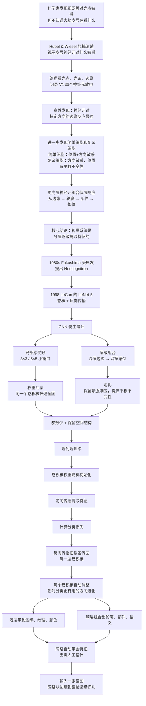

```mermaid
flowchart TD
    A[科学家发现视网膜对光点敏感<br/>但不知道大脑皮层在看什么] --> B[Hubel & Wiesel 想搞清楚<br/>视觉皮层神经元对什么敏感]
    B --> C[给猫看光点、光条、边缘<br/>记录 V1 单个神经元放电]
    C --> D[意外发现：神经元对<br/>特定方向的边缘反应最强]
    D --> E[进一步发现简单细胞和复杂细胞<br/>简单细胞：位置+方向敏感<br/>复杂细胞：方向敏感，位置有平移不变性]
    E --> F[更高层神经元组合低层响应<br/>从边缘 → 轮廓 → 部件 → 整体]
    F --> G[核心结论：视觉系统是<br/>分层逐级提取特征的]
    G --> H[1980s Fukushima 受启发<br/>提出 Neocognitron]
    H --> I[1998 LeCun 的 LeNet-5<br/>卷积 + 反向传播]
    I --> J[CNN 仿生设计]
    J --> K[局部感受野<br/>3×3 / 5×5 小窗口]
    J --> L[层级组合<br/>浅层边缘 → 深层语义]
    K --> M[权重共享<br/>同一个卷积核扫遍全图]
    L --> N[池化<br/>保留最强响应，提供平移不变性]
    M --> O[参数少 + 保留空间结构]
    N --> O
    O --> P[端到端训练]
    P --> Q[卷积核权重随机初始化]
    Q --> R[前向传播提取特征]
    R --> S[计算分类损失]
    S --> T[反向传播把误差传回<br/>每一层卷积核]
    T --> U[每个卷积核自动调整<br/>朝对分类更有用的方向进化]
    U --> V[浅层学到边缘、纹理、颜色]
    U --> W[深层组合出轮廓、部件、语义]
    V --> X[网络自动学会特征<br/>无需人工设计]
    W --> X
    X --> Y[输入一张猫图<br/>网络从边缘到猫脸逐级识别]
```
